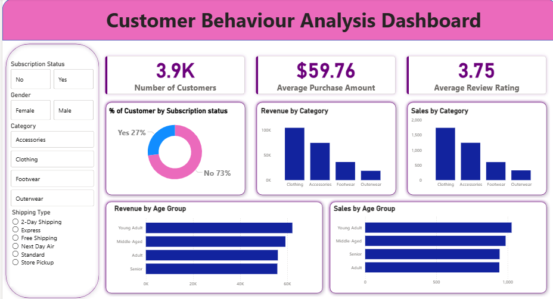

# Customer_behaviour_analysis_dashboard
Data analytics project showcasing customer behaviour analysis using python,sql and power BI
# Data Analytics Project – Customer Shopping Behavior Analysis

## Overview

This project demonstrates a complete **data analytics workflow** from data loading to business insights. The goal is to analyze customer purchasing behavior, identify patterns in product sales, and visualize key insights using interactive dashboards.

The project covers:

* Data loading and **Exploratory Data Analysis (EDA)** in Python
* Data cleaning and preparation
* Query-based analysis using SQL databases
* Dashboard creation for visual insights
* Final reporting and presentation of results

This project highlights practical skills used in real-world data analytics including data exploration, query analysis, visualization, and communication of insights.

---

## Dataset

The dataset contains customer shopping data including:

* Customer ID
* Age
* Gender
* Item Purchased
* Category
* Purchase Amount
* Payment Method
* Review Rating
* Discount Applied
* Subscription Status

The dataset is used to analyze purchasing trends, product popularity, and customer engagement patterns.

---

## Tools & Technologies

The following tools were used in this project:

**Programming & Analysis**

* Python
* Pandas
* NumPy

**Databases & Querying**

* PostgreSQL / MySQL / SQL Server
* SQL for data analysis

**Data Visualization**

* Power BI

**Reporting & Presentation**

* Microsoft PowerPoint
* Gamma (AI presentation tool)

---

## Project Workflow / Steps

### 1. Data Loading

The dataset was loaded into Python using Pandas for initial inspection and preprocessing.

### 2. Exploratory Data Analysis (EDA)

EDA was performed to understand the structure and distribution of the data. Key activities included:

* Checking dataset structure and data types
* Identifying missing values
* Analyzing product categories and purchase distribution
* Exploring rating trends and customer behavior

### 3. Data Cleaning

Data preprocessing steps included:

* Handling missing values
* Removing duplicates
* Formatting columns
* Preparing the dataset for analysis and database storage

### 4. SQL Data Analysis

The cleaned dataset was imported into a SQL database (PostgreSQL/MySQL/SQL Server). SQL queries were used to generate analytical insights such as:

* Most frequently purchased products
* Average review rating by product
* Revenue by category
* Discount usage patterns
* Subscription vs non-subscription purchases

### 5. Dashboard Development

An interactive **Power BI dashboard** was created to visualize key insights including:

* Product popularity
* Sales distribution by category
* Average customer ratings
* Discount usage trends
* Customer subscription analysis

The dashboard allows users to quickly explore business insights through visual representations.
## Dashboard Preview



### 6. Reporting

A structured analytical report was prepared summarizing the findings, trends, and insights derived from the analysis.

### 7. Presentation

A final presentation was created using **Gamma and PowerPoint** to communicate the results in a clear and professional format.

---

## Power BI Dashboard

The dashboard provides interactive visualizations that help stakeholders quickly understand customer purchasing behavior.

Key visualizations include:

* Product purchase distribution
* Average product ratings
* Discount usage analysis
* Category-based sales comparison
* Customer subscription insights

The dashboard enables data-driven decision making by presenting complex data in an easy-to-understand format.

---

## Key Results & Insights

Some important insights discovered during the analysis include:

* Certain product categories generate significantly higher purchases.
* Products with higher customer ratings tend to have more repeat purchases.
* Discount usage influences customer buying behavior.
* Subscription customers show more consistent purchasing patterns.

These insights can help businesses optimize product strategy, marketing campaigns, and customer engagement.

---

## How to Run the Project

1. Clone the repository
2. Install required Python libraries

```
pip install pandas numpy matplotlib seaborn
```

3. Run the Python notebook/script to perform EDA and data cleaning.
4. Import the cleaned dataset into your SQL database.
5. Execute the SQL queries provided in the project.
6. Open the Power BI file (.pbix) to view the interactive dashboard.

---

## Project Structure

```
data-analytics-project
│
├── dataset
├── python_eda.ipynb
├── sql_queries.sql
├── powerbi_dashboard.pbix
├── report.pdf
├── presentation.pptx
└── README.md
```

---

## Conclusion

This project demonstrates the complete **data analytics lifecycle**, from raw data exploration to visual storytelling and business insight generation. It showcases skills in Python-based analysis, SQL querying, dashboard development, and professional reporting.
